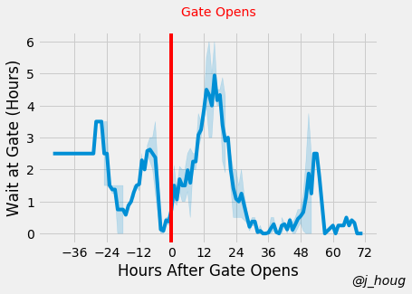
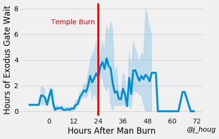
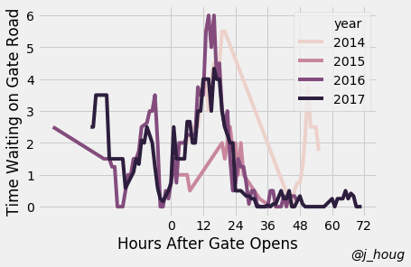
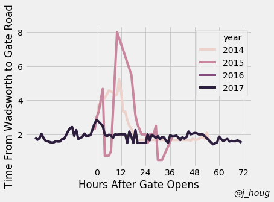

# ttitd-traffic
That thing in the desert has traffic. What is it like?

# Data

Scraped from @bmantraffic and manually annotated with wait times.
The data used, with time annotations is in the `data/` directory.
This only includes 4 years of data, 2014-2017. Lots of strange things,
happened! Sometimes the city gets shut down due to rain, or a misisng child.

# Graphs
Entry Gate Wait Times | Wadworth to 8 Mi Rd Wait Times | Exodus Gate Wait Times
:----------------:|:---------------:|:-------------------:
 |  | 
 |  | 

Don't read too much into the confidence intervals around the wait times.
I binned the reported wait times by hour and made these plots. They are in
no way independent samples. They just give you a very vague impression of the
variance in wait times.

